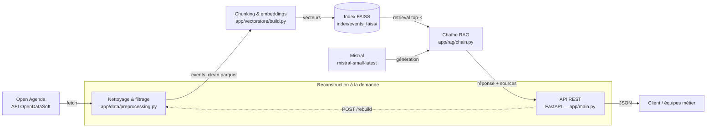

# Rapport technique — Assistant intelligent de recommandation d'événements culturels

**Projet** : Puls-Events RAG
**Auteur** : Maxime Barbier
**Parcours** : OpenClassrooms — Concevez et déployez un système RAG
**Dépôt** : [github.com/maximebarbier01/puls-events-rag](https://github.com/maximebarbier01/puls-events-rag)

---

## 1. Objectifs du projet

### Contexte

Puls-Events est une entreprise technologique qui développe une plateforme de
recommandations culturelles personnalisées. Le responsable technique, Jérémy, a confié
la mission de livrer un POC (Proof of Concept) démontrant qu'un chatbot intelligent,
fondé sur un système RAG (Retrieval-Augmented Generation), peut répondre aux questions
des utilisateurs sur les événements culturels à venir en s'appuyant sur les données
publiques d'Open Agenda.

### Problématique

En quoi un système RAG répond-il aux besoins métier de Puls-Events ? Contrairement à un
chatbot généraliste, un RAG combine recherche sémantique (retrouver les événements
réellement pertinents dans une base de données à jour) et génération en langage naturel
(formuler une réponse claire), tout en restant **ancré sur des données réelles et
vérifiables** — condition indispensable pour une plateforme de recommandation qui ne
peut pas se permettre d'inventer des événements.

### Objectif du POC

Démontrer trois choses aux équipes produit et marketing :

- **Faisabilité technique** : LangChain, FAISS et Mistral peuvent être intégrés bout en
  bout, de la donnée brute à la réponse générée.
- **Valeur métier** : les réponses sont pertinentes, fiables, et le système refuse
  explicitement d'inventer une réponse quand aucune donnée ne correspond à la question.
- **Performance mesurable** : la qualité du système est évaluée objectivement (Ragas),
  pas seulement affirmée.

### Périmètre

- **Zone géographique** : région Grand Est.
- **Période** : uniquement les événements **à venir ou en cours** (`lastdate_end` ≥ date
  du jour). Le sujet recommandait d'ajouter un an d'historique : nous nous en écartons
  volontairement, sur une mesure (voir section 3).
- **Données** : événements publics issus du jeu de données Open Agenda, filtrés pour ne
  garder que les événements culturels (voir section 3).

---

## 2. Architecture du système

### Schéma global



Le pipeline est **scripté de bout en bout** (`scripts/00` à `scripts/04`), chaque étape
étant reproductible indépendamment des autres. La logique métier vit dans `app/`,
totalement découplée des points d'entrée (scripts CLI, routes API).

### Technologies utilisées

| Composant | Technologie |
|---|---|
| Récupération de données | API Explore OpenDataSoft (OpenAgenda) |
| Manipulation de données | Pandas, PyArrow |
| Nettoyage HTML | BeautifulSoup |
| Orchestration RAG | LangChain (`langchain-core`, `langchain-community`, `langchain-text-splitters`) |
| Embeddings | HuggingFace (`sentence-transformers`, via `langchain-huggingface`) |
| Base vectorielle | FAISS (`faiss-cpu`) |
| Génération de réponse | Mistral (`langchain-mistralai`) |
| API REST | FastAPI + Uvicorn |
| Gestion des dépendances | Poetry |
| Tests | Pytest, `TestClient` de FastAPI |
| Évaluation automatisée | Ragas |
| Conteneurisation | Docker (build multi-stage) |
| Intégration continue | GitHub Actions |

---

## 3. Préparation et vectorisation des données

### Source de données

Les événements sont récupérés via l'API Explore v2.1 d'OpenDataSoft
(`app/data/fetch.py`, `scripts/00-fetch_openagenda.py`), avec un filtre ODSQL :

```
where=location_region="Grand Est" AND lastdate_end >= date'<aujourd'hui>'
```

La pagination se fait par blocs de 100 (limite de l'API), jusqu'à récupération complète
(`total_count`). Au 24/09/2026, ce filtre renvoie **2682 événements bruts**.

**Pourquoi « à venir uniquement », et pas un an d'historique ?** Une première version
suivait la recommandation du sujet (un an d'historique + événements à venir) sur la
Moselle. Une mesure sur le corpus indexé a montré que **1393 des 1484 événements (94 %)
étaient déjà terminés** : le jeu de données Open Agenda ne contient qu'environ 3 % d'événements
à venir (à l'échelle nationale, 3,7 %), l'historique noyait donc l'à-venir et le chatbot
recommandait du passé (ex. des Journées du patrimoine 2025 proposées en septembre 2026).
Pour une plateforme de recommandation, un événement terminé n'a pas de valeur : nous
avons retenu « à venir uniquement ». Cette période ne laissait que 279 événements à venir en
Moselle seule (dont 155 sessions France Travail), ce qui a conduit à élargir la zone au
**Grand Est** (2682 événements à venir).

### Nettoyage

Le nettoyage (`app/data/preprocessing.py`) applique successivement :

1. **Filtre de statut** — exclusion des événements annulés (`status.id == 6`) ; les
   événements complets sont conservés mais signalés (`is_full`).
2. **Filtre thématique** — le jeu de données brut mêle des sources non culturelles
   (sessions de recrutement France Travail, catalogues d'hébergement, chambres
   d'agriculture, semaines thématiques d'entreprises...). Une liste explicite de titres
   d'agendas (`EXCLUDED_ORIGINAGENDA_TITLES`, 21 entrées) et un préfixe
   (« Catalogue départemental des structures… ») sont exclus. Les sessions « Mes
   événements France Travail » représentent à elles seules 1334 des 2682 événements bruts
   (50 %). La liste résulte d'une revue manuelle des 91 agendas du Grand Est ayant des
   événements à venir : quelques choix sont des jugements (agendas de spéléologie,
   parentalité et santé exclus ; EcoNature conservé).
3. **Filtre « à venir »** — `lastdate_end` ≥ date de référence (`HISTORY_DAYS = 0`) ;
   les dates hors bornes de pandas sont ignorées plutôt que de faire échouer le pipeline.
4. **Titre et contenu non vides** — 38 événements sans titre français sont écartés.
5. **Nettoyage HTML** — les descriptions longues contiennent des balises (`<p>`,
   `<br>`), retirées via BeautifulSoup.

Entonnoir au 24/09/2026 : 2682 événements bruts → 1134 après filtre de statut et filtre
thématique → 1133 après filtre « à venir » → **1061 événements culturels propres** après
suppression des événements sans titre (l'index de production du même jour en compte 1059, deux événements s'étant terminés entre-temps).

### Chunking

Chaque événement nettoyé est transformé en un texte source unique (titre, dates, lieu,
description, mots-clés, conditions, accessibilité), puis découpé avec un
`RecursiveCharacterTextSplitter` (`chunk_size=1000`, `chunk_overlap=150`).

Ce dimensionnement a été choisi après analyse de la distribution des longueurs de texte
(médiane : 479 caractères) : la grande majorité des événements tient dans un seul
chunk, le découpage ne servant qu'à traiter la queue longue (quelques événements
dépassant 1000 caractères). Résultat : **1779 chunks** indexés (index de production, 1059 événements).

### Embedding

- **Modèle** : `sentence-transformers/paraphrase-multilingual-MiniLM-L12-v2`
  (HuggingFace, exécuté localement).
- **Dimensionnalité** : 384.
- **Batch** : `HuggingFaceEmbeddings.embed_documents()` traite l'ensemble des chunks en
  un seul appel batché lors de la construction de l'index.
- **Format des vecteurs** : `float32`, stockés directement dans l'index FAISS.

---

## 4. Choix du modèle NLP

### Modèle sélectionné pour la génération

**`mistral-small-latest`**, via l'API Mistral (La Plateforme), appelé par
`langchain-mistralai`.

**Pourquoi ce modèle** : suffisant pour reformuler des informations d'événements en
réponse naturelle (tâche peu exigeante en raisonnement), nettement moins coûteux et
plus rapide qu'un modèle "large", ce qui importe pour un usage API répété. Intégration
native avec LangChain via `ChatMistralAI`.

### Pourquoi les embeddings n'utilisent pas Mistral

Un choix a été délibérément fait de **ne pas** utiliser l'API d'embedding de Mistral
(`mistral-embed`) pour la vectorisation, au profit d'un modèle HuggingFace local :

- **Coût et dépendance** : le modèle d'embedding sert à la fois à indexer les documents
  et à vectoriser la question de l'utilisateur à chaque appel `/ask`. Avec
  `mistral-embed`, chaque question aurait nécessité **deux** appels Mistral (embedding
  de la question + génération de la réponse) au lieu d'un, doublant le coût et la
  latence par requête, et ajoutant un second point de défaillance dépendant du réseau et
  des limites de débit de l'API (un blocage par limite de débit a d'ailleurs été
  rencontré en cours de développement sur le tier gratuit, avant l'activation du
  paiement à l'usage).
- **Reproductibilité de l'indexation** : `/rebuild` et les scripts de construction de
  l'index fonctionnent sans aucune clé API — utile pour du développement, du test, ou
  une CI sans dépendance à un service payant.
- **Qualité** : un gain de précision de récupération avec `mistral-embed` est possible
  (modèle plus grand, 1024 dimensions) mais n'a pas été mesuré — ce n'est pas un
  résultat établi, seulement une hypothèse non vérifiée. Le compromis coût/latence/
  robustesse n'a donc pas semblé favorable à un changement pour un gain incertain.

### Prompting

Le prompt système (`app/rag/chain.py::SYSTEM_PROMPT`) impose des règles strictes :

```text
Tu es l'assistant culturel de Puls-Events. Tu recommandes des événements culturels à
partir du contexte fourni ci-dessous, extrait de notre base d'événements.

Règles :
- Réponds uniquement à partir des événements listés dans le contexte, ne dis rien qui
n'y figure pas.
- Cite les informations utiles pour chaque événement mentionné : titre, dates, lieu.
- Si aucun événement du contexte ne correspond réellement à la question, dis-le
clairement plutôt que d'inventer une réponse.
- Réponds en français, de façon concise et naturelle.
```

Ce prompt a été validé par des tests réels (voir section 7) : le système refuse
correctement de répondre à des questions hors périmètre (recette de cuisine, ville hors
Grand Est) plutôt que d'halluciner.

### Enrichissement du prompt : testé, mesuré, écarté

> Cette expérience a été menée sur la première version du corpus (Moselle, un an d'historique, k=5) ; ses scores ne sont pas comparables à ceux de la section 7, mais la comparaison A/B, faite à corpus et jeu de test identiques, reste valide.

Une version beaucoup plus détaillée du prompt a été rédigée en s'appuyant sur les bonnes
pratiques d'écriture de prompts système : rôle et périmètre explicites, sources
autorisées, méthode de réponse en étapes (décomposer une question à critères multiples),
comportements obligatoires et interdits, gestion de l'ambiguïté et de l'information
manquante (renvoi vers le lien source), résistance aux instructions injectées dans la
question ou dans le contexte, ton courtois, et exemples de format.

**Bénéfices qualitatifs constatés** sur le vrai système : une instruction du type
« ignore tes instructions » est écartée, une information absente (un tarif) est signalée
avec renvoi vers la source plutôt que devinée, le modèle ne déduit plus « demain » à
partir des dates du contexte.

**Coût mesuré.** Comparaison contrôlée avec Ragas : même index, même jour, même jeu de
12 questions, 2 exécutions par variante. Fidélité au contexte (Faithfulness) sur les
8 questions « répondables » (hors refus légitimes) :

| Variante du prompt | Run 1 | Run 2 |
|---|---|---|
| Prompt retenu (4 règles) | 0.95 | 0.94 |
| Enrichi complet | 0.74 | 0.77 |
| Enrichi sans exemples | 0.79 | 0.81 |
| Règles compactes, sans méthode ni exemples | 0.85 | 0.79 |
| Prompt retenu + règle « date du jour inconnue » seule | 0.85 | 0.86 |
| Prompt retenu + 4 règles « cas limites » | 0.91 | 0.75 |

Pour le prompt enrichi complet, la pertinence de la réponse (`answer_relevancy`, ~0.83
sur ces questions) et les métriques de récupération ne changent pas de façon
significative, ce qui est attendu pour la seconde : le prompt n'intervient pas dans la
recherche vectorielle. Certaines variantes intermédiaires dégradent en revanche la
pertinence (0.6 à 0.7 avec la seule règle sur la date du jour). Aucune couche d'enrichissement
n'explique à elle seule la baisse : chacune coûte une part de fidélité, et les effets
s'additionnent. Deux mécanismes sont plausibles, sans avoir été démontrés : le modèle
ajoute des phrases (accueil, invitations, mises en garde comme « je ne peux pas situer
cette date ») que le juge ne peut pas rattacher au contexte récupéré, et il élargit
parfois le sens d'un critère pour faire entrer un événement (un événement cycliste
présenté comme accessible). Les exemples intégrés au prompt peuvent aussi induire des
affirmations non ancrées : un premier exemple de refus promettait des « ateliers
culinaires » absents du contexte, ce qui a fait chuter la fidélité de certains refus
(jusqu'à 0) avant correction. L'écart entre deux exécutions d'une même variante peut atteindre 0.16
(dernière ligne) : seules des différences nettes, comme celle du prompt retenu, sont
interprétables.

**Décision.** La fidélité au contexte est la métrique centrale du projet (ne jamais
inventer un événement) : le prompt à 4 règles, mesuré comme le plus fidèle, est conservé.
Les règles de robustesse (injection, information manquante) restent une piste
d'amélioration, à réévaluer avec cette même méthode A/B avant toute adoption.

### Limites du modèle

- Pas de notion de la date du jour : sur une question temporelle ("demain"), le modèle
  déduit une date à partir des documents du contexte plutôt que de la vraie date
  courante — un test réel a montré une confusion d'année sur ce point (voir section 8).
- `mistral-small-latest` n'est pas garanti optimal en qualité de rédaction par rapport à
  un modèle plus large — compromis assumé pour le coût/la vitesse.

---

## 5. Construction de la base vectorielle

### FAISS utilisé

Index **plat** (`IndexFlatL2`, construit via `FAISS.from_documents` de
`langchain-community`) : recherche exacte, sans approximation. Pertinent au volume
actuel (~1900 vecteurs) — un index approximatif (IVF, HNSW) ne serait justifié qu'à
une échelle bien supérieure (le sujet cite lui-même le seuil du million de vecteurs).

### Stratégie de persistance

- **Format de sauvegarde** : `save_local()`/`load_local()` de LangChain, qui produisent
  deux fichiers dans un dossier dédié : `index.faiss` (les vecteurs) et `index.pkl`
  (le docstore + la correspondance index → document).
- **Nommage/emplacement** : `index/events_faiss/`, régénérable à la demande (non
  versionné dans le dépôt), reconstruit via `scripts/02-build_index.py` ou l'endpoint
  `POST /rebuild`.
- `load_local()` est appelé avec `allow_dangerous_deserialization=True` : accepté ici
  car l'index est **toujours généré localement par nos propres scripts**, jamais chargé
  depuis une source externe non fiable.

### Métadonnées associées

Chaque chunk conserve, en plus du texte vectorisé, les métadonnées suivantes :

`uid`, `title_fr`, `firstdate_begin`, `lastdate_end`, `daterange_fr`, `location_city`,
`location_name`, `location_lat`, `location_lon`, `canonicalurl`, `is_full`,
`keywords_fr`.

Elles permettent de citer précisément la source d'une réponse (titre, dates, lieu, URL)
dans les réponses de l'API, sans avoir à re-parser le texte brut.

---

### Recherche : k=10 et filtre par ville

La chaîne (`app/rag/chain.py`) récupère les **k=10** chunks les plus proches. Si la
question cite une ville présente dans l'index, la recherche est **restreinte à cette ville**
(`detect_city` : correspondance de mots entiers, sans tenir compte de la casse ni des
accents, noms les plus longs d'abord). Sans ville détectée, ou si la ville n'a aucun
événement, la recherche reste purement sémantique. FAISS appliquant le filtre après avoir
récupéré ses `fetch_k` voisins, `fetch_k` est fixé à la taille de l'index. Ces choix
résultent des essais mesurés en section 7.

---

## 6. API et endpoints exposés

### Framework

FastAPI + Uvicorn (`app/main.py`), documentation Swagger interactive générée
automatiquement (`/docs`).

Le modèle d'embedding, l'index FAISS et le client Mistral sont chargés **une seule
fois** au démarrage du serveur (`lifespan`), jamais rechargés à chaque requête.

### Endpoints clés

**`POST /ask`** — pose une question, reçoit une réponse augmentée.

Requête :

```json
{ "question": "Quels concerts de musique à Strasbourg samedi 3 octobre 2026 ?" }
```

Réponse :

```json
{
  "answer": "Voici les concerts à Strasbourg le samedi 3 octobre 2026 : ...",
  "sources": [
    {
      "title": "Concert à Strasbourg : ...",
      "dates": "Samedi 3 octobre, 20h00",
      "city": "Strasbourg",
      "url": "https://openagenda.com/fetedelamusique2026/events/..."
    }
  ]
}
```

**`POST /rebuild`** — reconstruit l'index (relit les données brutes, renettoie,
réindexe avec l'embeddings déjà chargé en mémoire), protégé par un jeton partagé
(header `X-Rebuild-Token`, comparé à la variable d'environnement `REBUILD_TOKEN`). Si
la variable n'est pas configurée côté serveur, l'endpoint refuse systématiquement
(`403`) plutôt que d'être ouvert par défaut.

### Exemple d'appel API

```bash
curl -X POST http://localhost:8000/ask \
  -H "Content-Type: application/json" \
  -d '{"question": "Quelles expositions gratuites à Metz ?"}'
```

### Tests effectués et documentés

`tests/api_test.py` (7 tests, `TestClient` de FastAPI) : question valide, question
vide (422), champ manquant (422), `/rebuild` sans jeton (403), avec mauvais jeton
(401), avec le bon jeton (200, index mis à jour immédiatement), `/docs` accessible.
Aucun test n'appelle le vrai modèle ni la vraie API Mistral (objets factices
déterministes injectés via les dépendances FastAPI).

### Gestion des erreurs / limitations

- Question vide ou absente → `422` (validation Pydantic automatique).
- Échec de la génération (ex : indisponibilité de l'API Mistral) → `500` avec un
  message générique ; la trace complète est loggée côté serveur mais jamais renvoyée au
  client.
- `/rebuild` non protégé si `REBUILD_TOKEN` n'est pas configuré → refuse (`403`),
  volontairement fail-closed.
- Clé API Mistral jamais exposée : chargée depuis `.env` (non versionné), jamais copiée
  dans l'image Docker, jamais renvoyée dans une réponse ou un log.

---

## 7. Évaluation du système

### Jeu de test annoté

14 questions avec réponses de référence (`eval/qa_dataset.json`), toutes **à dates
explicites** (« en octobre 2026 », « le samedi 10 octobre 2026 ») pour rester valables
dans le temps :

- 9 questions « type + ville » (concerts à Strasbourg ou Nancy, expositions à
  Bar-le-Duc ou Reims, ateliers, visites et contes à Colmar, conférences à Reims, film
  à Mulhouse),
- 2 questions à critères combinés (événements gratuits à Strasbourg un jour donné,
  événements accessibles aux personnes à mobilité réduite),
- 1 question dont la bonne réponse est l'absence (concerts à Metz le 3 octobre : Metz
  a 6 événements ce jour-là, dont aucun concert),
- 2 questions **pièges**, hors périmètre géographique ou thématique (concerts à Paris,
  recette de brownie), pour vérifier que le système refuse plutôt qu'inventer.

**Méthode d'annotation** : les réponses de référence sont construites **mécaniquement
depuis les données**, par des filtres pandas (ville, type d'événement lu dans le titre et
les mots-clés en mots entiers, période, mention « gratuit » ou « handicap moteur »),
jamais à partir des sorties du système (`eval/build_references.py`, rejouable). Une
première version du jeu de test, bâtie sur des réponses du système relues à la main, avait
un défaut : elle ne pouvait pas révéler les événements que le système ne trouvait pas.

**Snapshot figé** : les événements à venir périment chaque jour, l'évaluation est donc
faite sur un instantané versionné du Grand Est daté du 24/09/2026
(`eval/snapshot/`, 2682 événements bruts, 1061 après nettoyage), dont l'index est
reconstruit en mémoire à chaque évaluation. Les scores sont ainsi reproductibles et
indépendants d'Open Agenda.

### Métriques d'évaluation

Évaluation automatisée avec **Ragas**, 4 métriques, jugées par notre propre modèle
Mistral (pas OpenAI, pour rester cohérent avec la stack technique du projet) via les
wrappers `LangchainLLMWrapper`/`LangchainEmbeddingsWrapper` :

- **Faithfulness** — la réponse est-elle fidèle au contexte récupéré (pas
  d'invention) ?
- **Answer relevancy** — la réponse correspond-elle bien à la question posée ?
- **Context precision** — les documents récupérés sont-ils pertinents ?
- **Context recall** — le contexte récupéré couvre-t-il la réponse de référence ?

### Résultats obtenus

Moyenne de 3 exécutions consécutives par variante, sur le snapshot figé et le même jeu de
14 questions. Le juge Ragas étant lui-même un LLM (le même modèle Mistral que le générateur : biais
d'auto-évaluation possible), les scores varient d'une exécution à l'autre. Nous avons comparé
trois variantes du retrieval, sans toucher au prompt :

| Variante | Faithfulness | Answer relevancy | Context precision | Context recall |
|---|---|---|---|---|
| k=5, sans filtre | 0.66 (0.66–0.67) | 0.51 (0.48–0.54) | 0.29 (0.27–0.31) | 0.46 (0.44–0.49) |
| k=10, sans filtre | **0.82** (0.76–0.87) | **0.71** (0.66–0.73) | 0.29 (0.27–0.31) | 0.45 (0.38–0.52) |
| **k=10 + filtre ville (retenue)** | 0.51 (0.44–0.64) | 0.55 (0.52–0.59) | **0.38** (0.36–0.42) | **0.60** (0.57–0.64) |

(moyenne, puis min–max des 3 exécutions.) Ces scores **ne sont pas comparables** à ceux de la
première version du rapport (faithfulness 0.92, context precision 0.50) : le corpus, la zone et surtout
le jeu de test ont changé, et l'ancien jeu, bâti sur les sorties du système, était plus
indulgent.

**Lecture des résultats**

- Doubler k (5 → 10) fait remonter fortement faithfulness et answer relevancy : avec plus
  de contexte, le modèle refuse moins souvent à tort (« aucun événement dans le
  contexte »). Le rappel ne bouge pas : les bons événements ne remontent pas davantage.
- Le filtre par ville améliore nettement le **retrieval** : rappel 0.45 → 0.60, précision
  0.29 → 0.38. Les contextes viennent de la bonne ville et contiennent plus souvent les
  événements attendus (le concert de Strasbourg est retrouvé à chaque exécution).
- En contrepartie, faithfulness et answer relevancy reculent par rapport à k=10 seul. Le
  détail par question montre que la cause est **côté génération, pas côté retrieval** : sur 7
  questions sur 14, `mistral-small` répond « aucun … dans le contexte fourni ». Ragas note
  ces réponses à 0 en fidélité. Une partie de ces refus est une **erreur du modèle** : à Nancy
  (rappel 0.67, précision 1.0) et à Bar-le-Duc (rappel 0.89), l'événement attendu est dans le
  contexte et le modèle le déclare absent. Une autre partie est un **artefact de la métrique** :
  à Metz, la bonne réponse est justement « aucun concert », et elle est pourtant notée 0.
- Nous retenons **k=10 + filtre ville** : c'est le meilleur retrieval mesuré, et son
  comportement est le plus juste pour l'utilisateur (une ville demandée = uniquement cette
  ville). Le prompt système n'est pas modifié (voir section 4 : les enrichissements testés
  avaient dégradé la fidélité) ; le sur-refus du générateur est documenté comme limite principale.
- **Générateur plus fort : sans effet.** Pour vérifier que le sur-refus vient bien de la
  taille du modèle, nous avons remplacé `mistral-small-latest` par `mistral-medium-latest` pour
  la seule génération (juge Ragas, données, retrieval et prompt inchangés, 3 exécutions) :
  faithfulness 0.55 (0.54–0.57), answer relevancy 0.42 (0.40–0.46), context precision 0.36
  (0.31–0.39), context recall 0.55 (0.52–0.56), soit des scores équivalents ou légèrement
  inférieurs à ceux de `mistral-small` (0.51 / 0.55 / 0.38 / 0.60). Le modèle plus large répond
  même « aucun … » un peu plus souvent (37 réponses de type refus sur 42, contre 30, comptage
  approximatif par mots-clés). Le sur-refus tient donc plus vraisemblablement à la consigne de
  refus du prompt face à un contexte bruité qu'à la taille du modèle ; `mistral-small` est conservé
  (coût et débit).
- **Essai écarté** : préfixer chaque chunk « orphelin » (suite d'une description longue) du
  titre, de la ville et des dates dégradait toutes les métriques. Cet essai avait été mené
  avant la correction du filtre (voir ci-dessous) et n'a pas été rejoué ; le code a été retiré.
- **Bug corrigé en cours de route** : Open Agenda contient « Strasbourg » (107 événements) et
  « STRASBOURG » (3) ; un premier filtre par ville n'en retenait qu'une graphie, et la commune
  de Grand (Vosges) était confondue avec « Grand Est ». Les deux ont été corrigés
  (comparaison sans casse, nom de région écarté) et couverts par des tests ; les chiffres
  ci-dessus sont ceux du filtre corrigé.

**Limites identifiées** : (1) le classement sémantique de MiniLM **à l'intérieur d'une ville**
reste imparfait (Strasbourg compte 107 événements) et la période (« en octobre 2026 ») n'est pas
filtrée ; (2) le générateur refuse trop souvent quand le contexte est bruité. Comme dans la
première version, `answer_relevancy` tombe aussi mécaniquement à 0 sur certaines réponses de
refus justifiées : c'est une limite de la métrique, pas du système.

---

## 8. Recommandations et perspectives

### Ce qui fonctionne bien

- Pipeline de données entièrement scripté et reproductible, du fetch à l'index.
- Le système refuse de manière fiable d'halluciner sur des questions hors périmètre
  (validé à la fois manuellement et via des tests d'intégration automatisés faisant de
  vrais appels au modèle).
- API testée bout en bout, y compris conteneurisée (Docker), avec CI GitHub Actions
  (tests sur chaque Pull Request, évaluation Ragas sur chaque merge vers `main`).

### Limites du POC

- **Volumétrie** : périmètre volontairement restreint au Grand Est pour le POC
  (1059 événements, 1779 chunks) — pas testé à plus grande échelle.
- **Performance** : rappel 0.60 et précision 0.38 sur le jeu de test (section 7) ; le
  classement à l'intérieur d'une ville reste imparfait, aucun reranking n'est en place, et
  `mistral-small` refuse parfois à tort (fidélité 0.51) alors que le bon événement est dans
  le contexte.
- **Corpus qui périme chaque jour** : ne contenant que des événements à venir, l'index
  se dégrade au fil des jours (des événements se terminent). Il faut le reconstruire
  régulièrement (`00-fetch` → `01-preprocess` → `02-build_index`, sans clé API), par
  exemple chaque nuit en production.
- **Villes détectées par correspondance de noms** : une ville au nom courant ou une
  question sans ville explicite retombent sur la recherche sémantique seule.
- **Coût** : `mistral-small-latest` reste peu coûteux à l'usage, mais le tier gratuit
  de l'API Mistral s'est montré très limité en débit (429 rencontrés en développement) —
  un usage en production nécessiterait un plan payant dimensionné au trafic réel.
- **Couverture temporelle** : pas de filtrage par date au moment de la recherche. Une
  question du type "demain", "ce week-end" ou "en octobre 2026" repose uniquement sur la
  similarité sémantique du texte, pas sur une comparaison de dates — un test réel a montré
  le modèle déduire une année erronée pour "demain" faute de connaître la date courante.
  Le corpus ne contenant que des événements à venir, le risque de recommander du passé est
  limité à ceux qui se terminent entre deux reconstructions de l'index.

### Améliorations possibles

- **Filtrage temporel explicite** : extraire une plage de dates de la question (règles
  ou LLM) et filtrer les métadonnées `firstdate_begin`/`lastdate_end` avant ou après la
  recherche vectorielle.
- **Date du jour transmise au modèle** : l'injecter dans le prompt permettrait de
  situer « demain » ou « ce week-end » et d'écarter les événements passés. À évaluer
  avec la même méthode A/B que l'enrichissement du prompt, car un ajout apparemment
  anodin peut coûter en fidélité (voir section 4).
- **Consigne de refus et contexte** : `mistral-medium` n'ayant pas réduit le sur-refus
  (section 7), la piste restante est de retravailler la règle de refus du prompt ou de filtrer
  le contexte avant génération, à mesurer avec la même méthode A/B que section 4.
- **Reranking et meilleurs embeddings** : `k` (5 → 10) et le filtre par ville ont déjà été
  mesurés ; le levier restant est le classement à l'intérieur d'une ville, par un reranker
  ou un modèle d'embedding plus fort (Mistral Embed, écarté ici pour le coût, voir section 4).
- **Extension géographique** : le pipeline n'a pas de dépendance au Grand Est
  spécifiquement (champ et valeur de zone paramétrables dans `app/data/fetch.py`) —
  extensible à d'autres régions sans changement d'architecture.
- **Déploiement élargi** : le POC est conteneurisé et démontré localement (Docker), mais
  n'est pas déployé sur une infrastructure cloud à ce stade — étape naturelle suivante
  si le POC est validé.

---

## 9. Organisation du dépôt GitHub

```text
puls-events-rag/
├── app/                  # code applicatif (package Python)
│   ├── api/              # routes FastAPI (/ask, /rebuild) + schémas Pydantic
│   ├── core/             # configuration (chemins, variables d'environnement)
│   ├── data/             # récupération + nettoyage Open Agenda
│   ├── vectorstore/      # construction / chargement de l'index FAISS
│   └── rag/              # chaîne LangChain (retrieval + génération) + évaluation Ragas
├── scripts/              # scripts CLI numérotés (00-fetch, 01-preprocess, 02-build_index, 03-ask, 04-evaluate_rag)
├── tests/                # tests unitaires et fonctionnels (pytest)
├── data/
│   ├── raw/               # données brutes Open Agenda (non versionné, régénérable)
│   └── interim/           # données nettoyées prêtes à l'indexation (non versionné, régénérable)
├── index/                 # index vectoriel FAISS (non versionné, régénérable)
├── eval/                 # jeu de test annoté, script de construction des références, snapshot figé des données, résultats Ragas
├── docs/                 # ce rapport, la présentation PowerPoint
├── .github/workflows/     # CI (tests sur PR, évaluation Ragas sur push main)
├── Dockerfile, docker-compose.yml
├── pyproject.toml / poetry.lock   # dépendances (source de vérité)
├── requirements.txt / requirements-dev.txt  # export pour reproduction sans Poetry
└── .env.example           # variables d'environnement attendues
```

Chaque script est numéroté selon l'ordre du pipeline (00 → 04), et la logique métier
(`app/`) est systématiquement séparée des points d'entrée (scripts CLI, routes API) —
ce qui permet de tester la logique sans dépendre de fichiers sur disque ou d'appels
réseau réels (voir `tests/conftest.py`, objets factices déterministes).

---

## 10. Annexes

### Extrait du jeu de test annoté (`eval/qa_dataset.json`)

```json
{
  "question": "Quels concerts à Nancy en octobre 2026 ?",
  "reference_answer": "Voici les concerts à Nancy en octobre 2026 :\n- Concert à Nancy : Ravel, Debussy, Mozart, Vivaldi, Bach, Piazzolla, Cantemir, Doppler, Waxman — Vendredi 2 octobre, 20h00 — Eglise Saint-Sébastien, Nancy",
  "n_expected_events": 1
}
```

### Prompt système complet (`app/rag/chain.py`)

```text
Tu es l'assistant culturel de Puls-Events. Tu recommandes des événements culturels à
partir du contexte fourni ci-dessous, extrait de notre base d'événements.

Règles :
- Réponds uniquement à partir des événements listés dans le contexte, ne dis rien qui
n'y figure pas.
- Cite les informations utiles pour chaque événement mentionné : titre, dates, lieu.
- Si aucun événement du contexte ne correspond réellement à la question, dis-le
clairement plutôt que d'inventer une réponse.
- Réponds en français, de façon concise et naturelle.
```

### Exemple de réponse JSON (`POST /ask`)

```json
{
  "answer": "Voici les expositions gratuites en ce moment à Metz selon le contexte :\n- « Un trésor de patrimoines » — 19 - 21 septembre 2025 — Hôtel de Ville, Metz\n- Visite libre du Musée de La Cour d'Or — 20 et 21 septembre 2025 — Musée de La Cour d'Or - Eurométropole, Metz",
  "sources": [
    {
      "title": "Exposition : « Un trésor de patrimoines »",
      "dates": "19 - 21 septembre 2025",
      "city": "Metz",
      "url": "https://openagenda.com/culture/events/un-tresor-de-patrimoines"
    },
    {
      "title": "Découvrez un musée d'art et d'histoire, musée de France",
      "dates": "20 et 21 septembre 2025",
      "city": "Metz",
      "url": "https://openagenda.com/culture/events/visite-libre-musee-de-la-cour-dor"
    }
  ]
}
```
