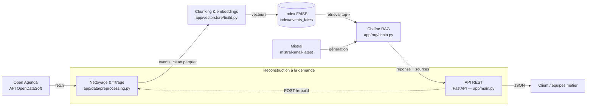

# Rapport technique — Assistant intelligent de recommandation d'événements culturels

**Projet** : Puls-Events RAG
**Auteur** : Maxime Barbier
**Parcours** : OpenClassrooms — Concevez et déployez un système RAG
**Dépôt** : [github.com/maximebarbier01/puls-events-rag](https://github.com/maximebarbier01/puls-events-rag)

---

## 1. Objectifs du projet

### Contexte

Puls-Events est une entreprise technologique qui développe une plateforme de
recommandations culturelles personnalisées. Le responsable technique, Jérémy, a confié
la mission de livrer un POC (Proof of Concept) démontrant qu'un chatbot intelligent,
fondé sur un système RAG (Retrieval-Augmented Generation), peut répondre aux questions
des utilisateurs sur les événements culturels à venir en s'appuyant sur les données
publiques d'Open Agenda.

### Problématique

En quoi un système RAG répond-il aux besoins métier de Puls-Events ? Contrairement à un
chatbot généraliste, un RAG combine recherche sémantique (retrouver les événements
réellement pertinents dans une base de données à jour) et génération en langage naturel
(formuler une réponse claire), tout en restant **ancré sur des données réelles et
vérifiables** — condition indispensable pour une plateforme de recommandation qui ne
peut pas se permettre d'inventer des événements.

### Objectif du POC

Démontrer trois choses aux équipes produit et marketing :

- **Faisabilité technique** : LangChain, FAISS et Mistral peuvent être intégrés bout en
  bout, de la donnée brute à la réponse générée.
- **Valeur métier** : les réponses sont pertinentes, fiables, et le système refuse
  explicitement d'inventer une réponse quand aucune donnée ne correspond à la question.
- **Performance mesurable** : la qualité du système est évaluée objectivement (Ragas),
  pas seulement affirmée.

### Périmètre

- **Zone géographique** : département de la Moselle (Grand Est).
- **Période** : un an d'historique, plus tous les événements à venir (pas de plafond
  dans le futur).
- **Données** : événements publics issus du jeu de données Open Agenda, filtrés pour ne
  garder que les événements culturels (voir section 3).

---

## 2. Architecture du système

### Schéma global



Le pipeline est **scripté de bout en bout** (`scripts/00` à `scripts/04`), chaque étape
étant reproductible indépendamment des autres. La logique métier vit dans `app/`,
totalement découplée des points d'entrée (scripts CLI, routes API).

### Technologies utilisées

| Composant | Technologie |
|---|---|
| Récupération de données | API Explore OpenDataSoft (OpenAgenda) |
| Manipulation de données | Pandas, PyArrow |
| Nettoyage HTML | BeautifulSoup |
| Orchestration RAG | LangChain (`langchain-core`, `langchain-community`, `langchain-text-splitters`) |
| Embeddings | HuggingFace (`sentence-transformers`, via `langchain-huggingface`) |
| Base vectorielle | FAISS (`faiss-cpu`) |
| Génération de réponse | Mistral (`langchain-mistralai`) |
| API REST | FastAPI + Uvicorn |
| Gestion des dépendances | Poetry |
| Tests | Pytest, `TestClient` de FastAPI |
| Évaluation automatisée | Ragas |
| Conteneurisation | Docker (build multi-stage) |
| Intégration continue | GitHub Actions |

---

## 3. Préparation et vectorisation des données

### Source de données

Les événements sont récupérés via l'API Explore v2.1 d'OpenDataSoft
(`app/data/fetch.py`, `scripts/00-fetch_openagenda.py`), avec un filtre ODSQL :

```
where=location_department="Moselle" AND lastdate_end >= date'<aujourd'hui - 365 jours>'
```

La pagination se fait par blocs de 100 (limite de l'API), jusqu'à récupération complète
(`total_count`). Au 19/09/2026, ce filtre renvoie **2829 événements bruts**.

### Nettoyage

Le nettoyage (`app/data/preprocessing.py`) applique successivement :

1. **Filtre de récence** — `lastdate_end >= aujourd'hui - 365 jours`, sans plafond
   futur (reprend la recommandation du sujet : "1 an d'historique et événements à
   venir").
2. **Filtre de statut** — exclusion des événements annulés (`status.id == 6`) ; les
   événements complets sont conservés mais signalés (`is_full`).
3. **Filtre thématique** — découverte faite en cours de développement :
   `location_department="Moselle"` seul renvoie des données non-culturelles (sessions
   de recrutement France Travail, agriculture, cyclisme promotionnel...). Une liste
   explicite de 12 sources (`EXCLUDED_ORIGINAGENDA_TITLES`) est exclue — dont les
   sessions "Mes événements France Travail", qui représentent à elles seules près de
   44% du volume brut (1236 sur 2829 événements).
4. **Nettoyage HTML** — les descriptions longues contiennent des balises (`<p>`,
   `<br>`), retirées via BeautifulSoup.

Après ces filtres : **1482 événements culturels propres**.

### Chunking

Chaque événement nettoyé est transformé en un texte source unique (titre, dates, lieu,
description, mots-clés, conditions, accessibilité), puis découpé avec un
`RecursiveCharacterTextSplitter` (`chunk_size=1000`, `chunk_overlap=150`).

Ce dimensionnement a été choisi après analyse de la distribution des longueurs de texte
(médiane : 479 caractères) : la grande majorité des événements tient dans un seul
chunk, le découpage ne servant qu'à traiter la queue longue (quelques événements
dépassant 1000 caractères). Résultat : **1918 chunks** indexés.

### Embedding

- **Modèle** : `sentence-transformers/paraphrase-multilingual-MiniLM-L12-v2`
  (HuggingFace, exécuté localement).
- **Dimensionnalité** : 384.
- **Batch** : `HuggingFaceEmbeddings.embed_documents()` traite l'ensemble des chunks en
  un seul appel batché lors de la construction de l'index.
- **Format des vecteurs** : `float32`, stockés directement dans l'index FAISS.

---

## 4. Choix du modèle NLP

### Modèle sélectionné pour la génération

**`mistral-small-latest`**, via l'API Mistral (La Plateforme), appelé par
`langchain-mistralai`.

**Pourquoi ce modèle** : suffisant pour reformuler des informations d'événements en
réponse naturelle (tâche peu exigeante en raisonnement), nettement moins coûteux et
plus rapide qu'un modèle "large", ce qui importe pour un usage API répété. Intégration
native avec LangChain via `ChatMistralAI`.

### Pourquoi les embeddings n'utilisent pas Mistral

Un choix a été délibérément fait de **ne pas** utiliser l'API d'embedding de Mistral
(`mistral-embed`) pour la vectorisation, au profit d'un modèle HuggingFace local :

- **Coût et dépendance** : le modèle d'embedding sert à la fois à indexer les documents
  et à vectoriser la question de l'utilisateur à chaque appel `/ask`. Avec
  `mistral-embed`, chaque question aurait nécessité **deux** appels Mistral (embedding
  de la question + génération de la réponse) au lieu d'un, doublant le coût et la
  latence par requête, et ajoutant un second point de défaillance dépendant du réseau et
  des limites de débit de l'API (un blocage par limite de débit a d'ailleurs été
  rencontré en cours de développement sur le tier gratuit, avant l'activation du
  paiement à l'usage).
- **Reproductibilité de l'indexation** : `/rebuild` et les scripts de construction de
  l'index fonctionnent sans aucune clé API — utile pour du développement, du test, ou
  une CI sans dépendance à un service payant.
- **Qualité** : un gain de précision de récupération avec `mistral-embed` est possible
  (modèle plus grand, 1024 dimensions) mais n'a pas été mesuré — ce n'est pas un
  résultat établi, seulement une hypothèse non vérifiée. Le compromis coût/latence/
  robustesse n'a donc pas semblé favorable à un changement pour un gain incertain.

### Prompting

Le prompt système (`app/rag/chain.py::SYSTEM_PROMPT`) impose des règles strictes :

```text
Tu es l'assistant culturel de Puls-Events. Tu recommandes des événements culturels à
partir du contexte fourni ci-dessous, extrait de notre base d'événements.

Règles :
- Réponds uniquement à partir des événements listés dans le contexte, ne dis rien qui
n'y figure pas.
- Cite les informations utiles pour chaque événement mentionné : titre, dates, lieu.
- Si aucun événement du contexte ne correspond réellement à la question, dis-le
clairement plutôt que d'inventer une réponse.
- Réponds en français, de façon concise et naturelle.
```

Ce prompt a été validé par des tests réels (voir section 7) : le système refuse
correctement de répondre à des questions hors périmètre (recette de cuisine, ville hors
Moselle) plutôt que d'halluciner.

### Enrichissement du prompt : testé, mesuré, écarté

Une version beaucoup plus détaillée du prompt a été rédigée en s'appuyant sur les bonnes
pratiques d'écriture de prompts système : rôle et périmètre explicites, sources
autorisées, méthode de réponse en étapes (décomposer une question à critères multiples),
comportements obligatoires et interdits, gestion de l'ambiguïté et de l'information
manquante (renvoi vers le lien source), résistance aux instructions injectées dans la
question ou dans le contexte, ton courtois, et exemples de format.

**Bénéfices qualitatifs constatés** sur le vrai système : une instruction du type
« ignore tes instructions » est écartée, une information absente (un tarif) est signalée
avec renvoi vers la source plutôt que devinée, le modèle ne déduit plus « demain » à
partir des dates du contexte.

**Coût mesuré.** Comparaison contrôlée avec Ragas : même index, même jour, même jeu de
12 questions, 2 exécutions par variante. Fidélité au contexte (Faithfulness) sur les
8 questions « répondables » (hors refus légitimes) :

| Variante du prompt | Run 1 | Run 2 |
|---|---|---|
| Prompt retenu (4 règles) | 0.95 | 0.94 |
| Enrichi complet | 0.74 | 0.77 |
| Enrichi sans exemples | 0.79 | 0.81 |
| Règles compactes, sans méthode ni exemples | 0.85 | 0.79 |
| Prompt retenu + règle « date du jour inconnue » seule | 0.85 | 0.86 |
| Prompt retenu + 4 règles « cas limites » | 0.91 | 0.75 |

Pour le prompt enrichi complet, la pertinence de la réponse (`answer_relevancy`, ~0.83
sur ces questions) et les métriques de récupération ne changent pas de façon
significative, ce qui est attendu pour la seconde : le prompt n'intervient pas dans la
recherche vectorielle. Certaines variantes intermédiaires dégradent en revanche la
pertinence (0.6 à 0.7 avec la seule règle sur la date du jour). Aucune couche d'enrichissement
n'explique à elle seule la baisse : chacune coûte une part de fidélité, et les effets
s'additionnent. Deux mécanismes sont plausibles, sans avoir été démontrés : le modèle
ajoute des phrases (accueil, invitations, mises en garde comme « je ne peux pas situer
cette date ») que le juge ne peut pas rattacher au contexte récupéré, et il élargit
parfois le sens d'un critère pour faire entrer un événement (un événement cycliste
présenté comme accessible). Les exemples intégrés au prompt peuvent aussi induire des
affirmations non ancrées : un premier exemple de refus promettait des « ateliers
culinaires » absents du contexte, ce qui a fait chuter la fidélité de certains refus
(jusqu'à 0) avant correction. L'écart entre deux exécutions d'une même variante peut atteindre 0.16
(dernière ligne) : seules des différences nettes, comme celle du prompt retenu, sont
interprétables.

**Décision.** La fidélité au contexte est la métrique centrale du projet (ne jamais
inventer un événement) : le prompt à 4 règles, mesuré comme le plus fidèle, est conservé.
Les règles de robustesse (injection, information manquante) restent une piste
d'amélioration, à réévaluer avec cette même méthode A/B avant toute adoption.

### Limites du modèle

- Pas de notion de la date du jour : sur une question temporelle ("demain"), le modèle
  déduit une date à partir des documents du contexte plutôt que de la vraie date
  courante — un test réel a montré une confusion d'année sur ce point (voir section 8).
- `mistral-small-latest` n'est pas garanti optimal en qualité de rédaction par rapport à
  un modèle plus large — compromis assumé pour le coût/la vitesse.

---

## 5. Construction de la base vectorielle

### FAISS utilisé

Index **plat** (`IndexFlatL2`, construit via `FAISS.from_documents` de
`langchain-community`) : recherche exacte, sans approximation. Pertinent au volume
actuel (~1900 vecteurs) — un index approximatif (IVF, HNSW) ne serait justifié qu'à
une échelle bien supérieure (le sujet cite lui-même le seuil du million de vecteurs).

### Stratégie de persistance

- **Format de sauvegarde** : `save_local()`/`load_local()` de LangChain, qui produisent
  deux fichiers dans un dossier dédié : `index.faiss` (les vecteurs) et `index.pkl`
  (le docstore + la correspondance index → document).
- **Nommage/emplacement** : `index/events_faiss/`, régénérable à la demande (non
  versionné dans le dépôt), reconstruit via `scripts/02-build_index.py` ou l'endpoint
  `POST /rebuild`.
- `load_local()` est appelé avec `allow_dangerous_deserialization=True` : accepté ici
  car l'index est **toujours généré localement par nos propres scripts**, jamais chargé
  depuis une source externe non fiable.

### Métadonnées associées

Chaque chunk conserve, en plus du texte vectorisé, les métadonnées suivantes :

`uid`, `title_fr`, `firstdate_begin`, `lastdate_end`, `daterange_fr`, `location_city`,
`location_name`, `location_lat`, `location_lon`, `canonicalurl`, `is_full`,
`keywords_fr`.

Elles permettent de citer précisément la source d'une réponse (titre, dates, lieu, URL)
dans les réponses de l'API, sans avoir à re-parser le texte brut.

---

## 6. API et endpoints exposés

### Framework

FastAPI + Uvicorn (`app/main.py`), documentation Swagger interactive générée
automatiquement (`/docs`).

Le modèle d'embedding, l'index FAISS et le client Mistral sont chargés **une seule
fois** au démarrage du serveur (`lifespan`), jamais rechargés à chaque requête.

### Endpoints clés

**`POST /ask`** — pose une question, reçoit une réponse augmentée.

Requête :

```json
{ "question": "Quels concerts de musique à Metz ce week-end ?" }
```

Réponse :

```json
{
  "answer": "Voici les concerts à Metz ce dimanche 21 juin : ...",
  "sources": [
    {
      "title": "Concerts Place de la Comédie - Metz",
      "dates": "Dimanche 21 juin, 17h00",
      "city": "Metz",
      "url": "https://openagenda.com/fetedelamusique2026/events/..."
    }
  ]
}
```

**`POST /rebuild`** — reconstruit l'index (relit les données brutes, renettoie,
réindexe avec l'embeddings déjà chargé en mémoire), protégé par un jeton partagé
(header `X-Rebuild-Token`, comparé à la variable d'environnement `REBUILD_TOKEN`). Si
la variable n'est pas configurée côté serveur, l'endpoint refuse systématiquement
(`403`) plutôt que d'être ouvert par défaut.

### Exemple d'appel API

```bash
curl -X POST http://localhost:8000/ask \
  -H "Content-Type: application/json" \
  -d '{"question": "Quelles expositions gratuites à Metz ?"}'
```

### Tests effectués et documentés

`tests/api_test.py` (7 tests, `TestClient` de FastAPI) : question valide, question
vide (422), champ manquant (422), `/rebuild` sans jeton (403), avec mauvais jeton
(401), avec le bon jeton (200, index mis à jour immédiatement), `/docs` accessible.
Aucun test n'appelle le vrai modèle ni la vraie API Mistral (objets factices
déterministes injectés via les dépendances FastAPI).

### Gestion des erreurs / limitations

- Question vide ou absente → `422` (validation Pydantic automatique).
- Échec de la génération (ex : indisponibilité de l'API Mistral) → `500` avec un
  message générique ; la trace complète est loggée côté serveur mais jamais renvoyée au
  client.
- `/rebuild` non protégé si `REBUILD_TOKEN` n'est pas configuré → refuse (`403`),
  volontairement fail-closed.
- Clé API Mistral jamais exposée : chargée depuis `.env` (non versionné), jamais copiée
  dans l'image Docker, jamais renvoyée dans une réponse ou un log.

---

## 7. Évaluation du système

### Jeu de test annoté

12 questions avec réponses de référence (`eval/qa_dataset.json`), couvrant :

- des questions factuelles simples ("Quel musée visiter en ce mois de septembre à
  Metz ?"),
- des questions à critères combinés ("Quels événements accessibles aux personnes à
  mobilité réduite en Moselle ?"),
- des questions ouvertes ("Recommande-moi une sortie culturelle originale."),
- des questions **pièges**, volontairement hors périmètre géographique ou thématique
  ("Quels concerts à Paris ce week-end ?", "Quelle est la recette du brownie au
  chocolat ?"), pour vérifier que le système refuse de répondre plutôt que d'inventer.

**Méthode d'annotation** : les réponses de référence ont été construites à partir de
réponses réellement produites par le système sur les vraies données, relues et
validées manuellement — pas générées indépendamment du système, ce qui garantit
qu'elles sont factuellement ancrées dans le corpus réel.

### Métriques d'évaluation

Évaluation automatisée avec **Ragas**, 4 métriques, jugées par notre propre modèle
Mistral (pas OpenAI, pour rester cohérent avec la stack technique du projet) via les
wrappers `LangchainLLMWrapper`/`LangchainEmbeddingsWrapper` :

- **Faithfulness** — la réponse est-elle fidèle au contexte récupéré (pas
  d'invention) ?
- **Answer relevancy** — la réponse correspond-elle bien à la question posée ?
- **Context precision** — les documents récupérés sont-ils pertinents ?
- **Context recall** — le contexte récupéré couvre-t-il la réponse de référence ?

### Résultats obtenus

| Métrique | Score global (12 questions) | Hors questions pièges (8 questions) |
|---|---|---|
| Faithfulness | 0.888 | 0.895 |
| Answer relevancy | 0.548 | 0.822 |
| Context precision | 0.660 | 0.667 |
| Context recall | 0.872 | 0.933 |

**Analyse qualitative** : les scores `answer_relevancy` et `context_recall` chutent
fortement sur les 4 questions pièges, alors même que le système **répond
correctement en refusant**. `answer_relevancy` compare, par similarité sémantique, la
question posée à des questions reconstruites à partir de la réponse — une réponse de
refus courte ("Aucun événement... ne propose de recette") ne "ressemble" pas à la
question initiale, ce qui fait chuter le score mécaniquement. C'est une limite connue
de la métrique elle-même, pas un défaut de fonctionnement du système : recalculées sur
les seules questions "répondables", les métriques remontent nettement
(`answer_relevancy` : 0.822).

Le point faible réel identifié est le **context precision** (~0.66), y compris hors
questions pièges : une partie des documents récupérés (k=5) n'est pas toujours
pertinente pour la question posée — piste d'amélioration détaillée en section 8.

---

## 8. Recommandations et perspectives

### Ce qui fonctionne bien

- Pipeline de données entièrement scripté et reproductible, du fetch à l'index.
- Le système refuse de manière fiable d'halluciner sur des questions hors périmètre
  (validé à la fois manuellement et via des tests d'intégration automatisés faisant de
  vrais appels au modèle).
- API testée bout en bout, y compris conteneurisée (Docker), avec CI GitHub Actions
  (tests sur chaque Pull Request, évaluation Ragas sur chaque merge vers `main`).

### Limites du POC

- **Volumétrie** : périmètre volontairement restreint à la Moselle pour le POC
  (1482 événements, 1918 chunks) — pas testé à plus grande échelle.
- **Performance** : `context_precision` (~0.66) indique qu'une part des documents
  récupérés n'est pas optimale ; pas d'optimisation de `k` ni de reranking à ce stade.
- **Coût** : `mistral-small-latest` reste peu coûteux à l'usage, mais le tier gratuit
  de l'API Mistral s'est montré très limité en débit (429 rencontrés en développement) —
  un usage en production nécessiterait un plan payant dimensionné au trafic réel.
- **Couverture temporelle** : pas de filtrage réel par date. Une question du type
  "demain" ou "ce week-end" repose uniquement sur la similarité sémantique du texte, pas
  sur une comparaison de dates — un test réel a montré le modèle déduire une année
  erronée pour "demain" faute de connaître la date courante. Conséquence liée : la
  fenêtre d'un an d'historique, demandée par le sujet, fait que des événements déjà
  passés peuvent être recommandés comme s'ils étaient à venir (observé : un événement de
  septembre 2025 proposé en réponse à une question posée en septembre 2026).

### Améliorations possibles

- **Filtrage temporel explicite** : extraire une plage de dates de la question (règles
  ou LLM) et filtrer les métadonnées `firstdate_begin`/`lastdate_end` avant ou après la
  recherche vectorielle.
- **Date du jour transmise au modèle** : l'injecter dans le prompt permettrait de
  situer « demain » ou « ce week-end » et d'écarter les événements passés. À évaluer
  avec la même méthode A/B que l'enrichissement du prompt, car un ajout apparemment
  anodin peut coûter en fidélité (voir section 4).
- **Ajustement de `k` et reranking** : comparer plusieurs valeurs de `k` sur le jeu de
  test annoté, envisager un reranking des résultats FAISS avant de les transmettre au
  LLM, pour améliorer `context_precision`.
- **Extension géographique** : le pipeline n'a pas de dépendance à la Moselle
  spécifiquement (paramètre de département dans `app/data/fetch.py`) — extensible à
  d'autres zones sans changement d'architecture.
- **Déploiement élargi** : le POC est conteneurisé et démontré localement (Docker), mais
  n'est pas déployé sur une infrastructure cloud à ce stade — étape naturelle suivante
  si le POC est validé.

---

## 9. Organisation du dépôt GitHub

```text
puls-events-rag/
├── app/                  # code applicatif (package Python)
│   ├── api/              # routes FastAPI (/ask, /rebuild) + schémas Pydantic
│   ├── core/             # configuration (chemins, variables d'environnement)
│   ├── data/             # récupération + nettoyage Open Agenda
│   ├── vectorstore/      # construction / chargement de l'index FAISS
│   └── rag/              # chaîne LangChain (retrieval + génération) + évaluation Ragas
├── scripts/              # scripts CLI numérotés (00-fetch, 01-preprocess, 02-build_index, 03-ask, 04-evaluate_rag)
├── tests/                # tests unitaires et fonctionnels (pytest)
├── data/
│   ├── raw/               # données brutes Open Agenda (non versionné, régénérable)
│   └── interim/           # données nettoyées prêtes à l'indexation (non versionné, régénérable)
├── index/                 # index vectoriel FAISS (non versionné, régénérable)
├── eval/                 # jeu de questions/réponses annoté + résultats Ragas
├── docs/                 # ce rapport, la présentation PowerPoint
├── .github/workflows/     # CI (tests sur PR, évaluation Ragas sur push main)
├── Dockerfile, docker-compose.yml
├── pyproject.toml / poetry.lock   # dépendances (source de vérité)
├── requirements.txt / requirements-dev.txt  # export pour reproduction sans Poetry
└── .env.example           # variables d'environnement attendues
```

Chaque script est numéroté selon l'ordre du pipeline (00 → 04), et la logique métier
(`app/`) est systématiquement séparée des points d'entrée (scripts CLI, routes API) —
ce qui permet de tester la logique sans dépendre de fichiers sur disque ou d'appels
réseau réels (voir `tests/conftest.py`, objets factices déterministes).

---

## 10. Annexes

### Extrait du jeu de test annoté (`eval/qa_dataset.json`)

```json
{
  "question": "Quels concerts de musique à Metz ce week-end ?",
  "reference_answer": "Voici les concerts à Metz ce dimanche 21 juin :\n\nPlace de la Comédie :\n- Lycée Georges de la Tour option musique : 17h30 (Pop)\n- Séga Vibes : 20h00 (Musique du monde)\n..."
}
```

### Prompt système complet (`app/rag/chain.py`)

```text
Tu es l'assistant culturel de Puls-Events. Tu recommandes des événements culturels à
partir du contexte fourni ci-dessous, extrait de notre base d'événements.

Règles :
- Réponds uniquement à partir des événements listés dans le contexte, ne dis rien qui
n'y figure pas.
- Cite les informations utiles pour chaque événement mentionné : titre, dates, lieu.
- Si aucun événement du contexte ne correspond réellement à la question, dis-le
clairement plutôt que d'inventer une réponse.
- Réponds en français, de façon concise et naturelle.
```

### Exemple de réponse JSON (`POST /ask`)

```json
{
  "answer": "Voici les expositions gratuites en ce moment à Metz selon le contexte :\n- « Un trésor de patrimoines » — 19 - 21 septembre 2025 — Hôtel de Ville, Metz\n- Visite libre du Musée de La Cour d'Or — 20 et 21 septembre 2025 — Musée de La Cour d'Or - Eurométropole, Metz",
  "sources": [
    {
      "title": "Exposition : « Un trésor de patrimoines »",
      "dates": "19 - 21 septembre 2025",
      "city": "Metz",
      "url": "https://openagenda.com/culture/events/un-tresor-de-patrimoines"
    },
    {
      "title": "Découvrez un musée d'art et d'histoire, musée de France",
      "dates": "20 et 21 septembre 2025",
      "city": "Metz",
      "url": "https://openagenda.com/culture/events/visite-libre-musee-de-la-cour-dor"
    }
  ]
}
```
